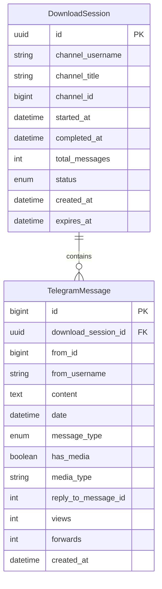

# PostgreSQL Integration PRD
## Telegram Channel Downloader Database Enhancement

**Document Version:** 1.0  
**Date:** September 7, 2025  
**Author:** System Architect  
**Project:** Telegram Channel Downloader PostgreSQL Integration  

---

## Executive Summary

Transform the Telegram Channel Downloader from file-based storage to PostgreSQL database storage, enabling efficient handling of millions of messages while maintaining the existing clean 3-layer architecture. This enhancement will provide better data management, search capabilities, and lifecycle management for downloaded Telegram channel content.

---

## Project Overview

### Business Context
The current Telegram Channel Downloader saves downloaded messages and metadata to local directories and files. To improve data management, search capabilities, and handle large-scale downloads efficiently, we need to integrate PostgreSQL database storage while maintaining the application's clean architecture.

### Problem Statement
- File-based storage lacks efficient search and filtering capabilities
- Difficulty managing large volumes of downloaded messages (millions of records)
- No structured data lifecycle management
- Limited querying capabilities for downloaded content

### Solution Approach
Implement PostgreSQL database integration using Entity Framework Core within the existing 3-layer clean architecture, focusing on metadata and message content storage without media files.

---

## Stakeholders & Users

### Primary Stakeholders
- **End User**: Individual using the application to download and manage Telegram channel content
- **Development Team**: Responsible for implementation and maintenance
- **System Administrator**: Handles database setup and maintenance

### User Personas
- **Power User**: Downloads large channels with millions of messages, needs efficient storage and basic search
- **Casual User**: Downloads smaller channels occasionally, needs simple operation without complex configuration

---

## Functional Requirements

### Core Features

#### FR-1: Database Storage Integration
- **Description**: Store message metadata and content in PostgreSQL database instead of files
- **Acceptance Criteria**:
  - All downloaded messages stored in structured database format
  - No media files stored in database (metadata only)
  - Maintain existing download workflow and user experience
  - Support for millions of messages efficiently

#### FR-2: Download Session Management  
- **Description**: Track download sessions with comprehensive metadata
- **Acceptance Criteria**:
  - Each download session creates a database record
  - Session includes channel information, timestamps, and status
  - Progress tracking throughout download process
  - Session completion and status updates

#### FR-3: Data Lifecycle Management
- **Description**: Automatic cleanup of old data based on retention policies
- **Acceptance Criteria**:
  - Configurable retention period (default: 30 days for MVP)
  - Automatic background cleanup of expired sessions
  - User notification before data expiration
  - Manual cleanup trigger option

#### FR-4: Performance Optimization
- **Description**: Efficient handling of large-scale message downloads
- **Acceptance Criteria**:
  - Batch processing for message insertions (1000 messages per batch)
  - Optimized database indexes for common queries
  - Memory-efficient processing for millions of records
  - Progress reporting during large downloads

### User Stories

#### US-1: Database Configuration
**As a** user  
**I want** to configure database connection settings  
**So that** I can connect to my PostgreSQL instance  

**Acceptance Criteria:**
- Database connection configuration in settings UI
- Connection validation before starting downloads
- Error handling for connection failures
- Local database setup guidance

#### US-2: Efficient Large Channel Downloads
**As a** user  
**I want** to download channels with millions of messages  
**So that** I can archive large Telegram channels efficiently  

**Acceptance Criteria:**
- Download progress indication with batch completion
- Memory usage remains stable during large downloads
- Ability to pause/resume large downloads
- Performance metrics display (messages/second, estimated completion)

#### US-3: Data Lifecycle Management
**As a** user  
**I want** automatic cleanup of old downloads  
**So that** my database doesn't grow indefinitely  

**Acceptance Criteria:**
- Configurable retention period in settings
- Automatic cleanup scheduling
- Notification before data deletion
- Manual cleanup execution option

---

## Technical Requirements

### Architecture Decisions

#### AR-1: Maintain Clean 3-Layer Architecture
- **Desktop Layer**: WPF UI with MVVM pattern (unchanged)
- **Core Layer**: Business logic enhanced with database operations
- **TelegramApi Layer**: API integration (minimal changes)

#### AR-2: Entity Framework Core Integration
- **ORM**: Entity Framework Core 8.0+ with PostgreSQL provider
- **Migration Strategy**: Code-first approach with automatic migrations
- **Connection Management**: Single-user local database for MVP

#### AR-3: Repository Pattern Implementation
- **Data Access**: Repository pattern for database operations
- **Dependency Injection**: Integration with existing DI container
- **Interface Segregation**: Separate interfaces for different data operations

### Technology Stack

#### Database Layer
- **Database**: PostgreSQL 16+
- **ORM**: Entity Framework Core 8.0
- **Provider**: Npgsql.EntityFrameworkCore.PostgreSQL 8.0
- **Migration**: EF Core Migrations

#### Application Integration
- **Framework**: .NET 8.0 Windows (existing)
- **DI Container**: Microsoft.Extensions.DependencyInjection (existing)
- **Configuration**: Microsoft.Extensions.Configuration (existing)

### Performance Requirements

#### PR-1: Scalability Targets
- **Message Volume**: Handle up to 10 million messages per download session
- **Batch Processing**: 1000 messages per database transaction
- **Memory Usage**: Maximum 2GB RAM during large downloads
- **Response Time**: < 100ms for common database queries

#### PR-2: Database Performance
- **Insert Performance**: > 1000 messages/second during bulk import
- **Query Performance**: < 1 second for typical search operations
- **Index Strategy**: Optimized indexes for date, content, and session queries
- **Connection Pooling**: Efficient connection management

### Security Specifications

#### SE-1: Database Security
- **Authentication**: PostgreSQL user authentication
- **Connection**: Encrypted connection strings in configuration
- **Access Control**: Single-user database access for MVP
- **Data Protection**: No sensitive user data stored beyond message content

#### SE-2: Data Privacy
- **Content Storage**: Only public channel messages stored
- **User Data**: No personal user information beyond Telegram usernames
- **Retention**: Automatic data cleanup per retention policies

---

## Data Model

### Entity Relationships



### Database Schema

#### DownloadSession Table
| Column | Type | Constraints | Description |
|--------|------|-------------|-------------|
| id | UUID | PRIMARY KEY | Unique session identifier |
| channel_username | VARCHAR(255) | NOT NULL | Telegram channel username |
| channel_title | VARCHAR(500) | NOT NULL | Channel display title |
| channel_id | BIGINT | NOT NULL | Telegram channel ID |
| started_at | TIMESTAMP | NOT NULL | Download start time |
| completed_at | TIMESTAMP | NULL | Download completion time |
| total_messages | INTEGER | DEFAULT 0 | Total messages downloaded |
| status | VARCHAR(50) | NOT NULL | Session status enum |
| created_at | TIMESTAMP | DEFAULT NOW() | Record creation time |
| expires_at | TIMESTAMP | NULL | Data expiration time |

#### TelegramMessage Table
| Column | Type | Constraints | Description |
|--------|------|-------------|-------------|
| id | BIGINT | PRIMARY KEY | Telegram message ID |
| download_session_id | UUID | FOREIGN KEY | Reference to session |
| from_id | BIGINT | NOT NULL | Sender Telegram ID |
| from_username | VARCHAR(255) | NULL | Sender username |
| content | TEXT | NULL | Message text content |
| date | TIMESTAMP | NOT NULL | Message timestamp |
| message_type | VARCHAR(50) | NOT NULL | Message type enum |
| has_media | BOOLEAN | DEFAULT FALSE | Media attachment flag |
| media_type | VARCHAR(100) | NULL | Type of media attachment |
| reply_to_message_id | INTEGER | NULL | Referenced message ID |
| views | INTEGER | DEFAULT 0 | Message view count |
| forwards | INTEGER | DEFAULT 0 | Forward count |
| created_at | TIMESTAMP | DEFAULT NOW() | Record creation time |

### Indexes Strategy
```sql
-- Performance indexes for efficient querying
CREATE INDEX idx_messages_session_date ON telegram_message (download_session_id, date DESC);
CREATE INDEX idx_messages_content_search ON telegram_message USING gin(to_tsvector('english', content));
CREATE INDEX idx_messages_sender ON telegram_message (from_id, date DESC);
CREATE INDEX idx_sessions_channel ON download_session (channel_id, started_at DESC);
CREATE INDEX idx_sessions_status ON download_session (status, created_at);
CREATE INDEX idx_messages_expires ON download_session (expires_at) WHERE expires_at IS NOT NULL;
```

---

## Implementation Plan

### Phase 1: Database Infrastructure Setup (Week 1)
**Duration:** 5 days  
**Priority:** High  

#### Tasks:
1. **Database Setup**
   - Install PostgreSQL 16+ locally
   - Create telegram_downloads database
   - Configure user permissions
   - Document setup process

2. **Project Configuration**
   - Add EF Core NuGet packages to all projects
   - Configure connection strings
   - Set up development environment

3. **Entity Design**
   - Create entity models (DownloadSession, TelegramMessage)
   - Define enums and value objects
   - Implement model validation

**Deliverables:**
- Working PostgreSQL instance
- Entity models implemented
- Connection configuration ready

### Phase 2: Entity Framework Integration (Week 2)
**Duration:** 7 days  
**Priority:** High  

#### Tasks:
1. **DbContext Implementation**
   - Create TelegramDbContext
   - Configure entity relationships
   - Set up database indexes
   - Create initial migration

2. **Repository Pattern**
   - Implement IMessageRepository interface
   - Create MessageRepository with CRUD operations
   - Add batch processing methods
   - Integration with existing DI container

3. **Data Access Layer Testing**
   - Unit tests for repositories
   - Integration tests with test database
   - Performance testing with sample data

**Deliverables:**
- Functional EF Core integration
- Repository pattern implemented
- Basic database operations working

### Phase 3: Service Layer Integration (Week 3)
**Duration:** 7 days  
**Priority:** High  

#### Tasks:
1. **DownloadService Enhancement**
   - Modify existing DownloadService for database storage
   - Implement session management
   - Add progress reporting for database operations
   - Error handling and retry logic

2. **Batch Processing Implementation**
   - Message batching logic (1000 messages per batch)
   - Memory-efficient processing
   - Progress tracking per batch
   - Transaction management

3. **Performance Optimization**
   - Bulk insert operations
   - Connection pooling configuration
   - Memory usage optimization
   - Query performance tuning

**Deliverables:**
- Enhanced DownloadService with database storage
- Efficient batch processing
- Performance benchmarks met

### Phase 4: Data Lifecycle & UI Integration (Week 4)
**Duration:** 7 days  
**Priority:** Medium  

#### Tasks:
1. **Lifecycle Management**
   - Implement DataLifecycleService
   - Automatic cleanup scheduling
   - Configurable retention policies
   - Background service integration

2. **UI Enhancements**
   - Database configuration settings
   - Progress display for database operations
   - Session management UI
   - Error handling and user feedback

3. **Testing & Documentation**
   - End-to-end testing
   - Performance testing with large datasets
   - User documentation updates
   - Database maintenance procedures

**Deliverables:**
- Complete lifecycle management system
- Updated UI with database features
- Comprehensive testing completed

---

## Risk Assessment

### Technical Risks

#### TR-1: Performance with Large Datasets
**Risk Level:** High  
**Description:** Database performance degradation with millions of messages  
**Mitigation Strategies:**
- Comprehensive indexing strategy
- Batch processing implementation
- Performance testing with realistic datasets
- Query optimization and monitoring

#### TR-2: Database Connection Issues
**Risk Level:** Medium  
**Description:** PostgreSQL connection failures or instability  
**Mitigation Strategies:**
- Connection pooling and retry logic
- Comprehensive error handling
- Fallback mechanisms
- Connection health monitoring

#### TR-3: Data Migration Complexity
**Risk Level:** Low  
**Description:** EF Core migration issues during development  
**Mitigation Strategies:**
- Code-first approach with careful migration planning
- Database backup procedures
- Migration testing in isolated environments
- Rollback procedures documented

### Business Risks

#### BR-1: User Experience Impact
**Risk Level:** Medium  
**Description:** Changes affecting existing user workflows  
**Mitigation Strategies:**
- Maintain existing UI patterns
- Comprehensive user testing
- Gradual feature rollout
- Clear user communication

#### BR-2: Setup Complexity
**Risk Level:** Medium  
**Description:** PostgreSQL setup complexity for end users  
**Mitigation Strategies:**
- Detailed setup documentation
- Automated setup scripts
- Default configuration options
- Support for common scenarios

---

## Testing Strategy

### Unit Testing
- **Repository Pattern Testing**: Mock database context for isolated testing
- **Service Layer Testing**: Test business logic with repository mocks
- **Entity Model Testing**: Validation and relationship testing

### Integration Testing
- **Database Integration**: Real PostgreSQL database with test containers
- **End-to-End Workflows**: Complete download and storage scenarios
- **Performance Testing**: Large dataset scenarios (1M+ messages)

### Performance Testing
- **Load Testing**: Concurrent download sessions
- **Stress Testing**: Maximum message volume scenarios  
- **Memory Testing**: Long-running download sessions
- **Query Performance**: Database query optimization validation

### User Acceptance Testing
- **Workflow Testing**: Existing user scenarios with database storage
- **Setup Testing**: PostgreSQL installation and configuration
- **Performance Validation**: User-acceptable response times

---

## Deployment & Operations

### Development Environment
```json
{
  "ConnectionStrings": {
    "DefaultConnection": "Host=localhost;Database=telegram_downloads_dev;Username=dev_user;Password=dev_password"
  },
  "Database": {
    "RetentionDays": 7,
    "BatchSize": 100,
    "EnablePerformanceIndexes": true
  }
}
```

### Production Environment  
```json
{
  "ConnectionStrings": {
    "DefaultConnection": "Host=localhost;Database=telegram_downloads;Username=telegram_user;Password=***"
  },
  "Database": {
    "RetentionDays": 30,
    "BatchSize": 1000,
    "EnablePerformanceIndexes": true,
    "ConnectionPoolSize": 10
  }
}
```

### Database Maintenance
- **Backup Strategy**: Daily automated backups with 7-day retention
- **Monitoring**: Database size and performance monitoring
- **Maintenance Windows**: Weekly maintenance for index rebuilding
- **Cleanup Procedures**: Automated expired data cleanup

### Deployment Checklist
1. ✅ PostgreSQL server installed and configured
2. ✅ Database created with proper permissions
3. ✅ Application configuration updated
4. ✅ EF Core migrations applied
5. ✅ Performance indexes created
6. ✅ Backup procedures configured
7. ✅ Monitoring setup completed

---

## Success Criteria

### Functional Success Criteria
- ✅ All downloaded messages stored in PostgreSQL database
- ✅ Download sessions tracked with complete metadata
- ✅ Automatic data lifecycle management operational
- ✅ Performance targets met for large downloads
- ✅ Existing user workflow preserved

### Technical Success Criteria
- ✅ Handle 10M+ messages per session efficiently
- ✅ < 2GB memory usage during large downloads
- ✅ > 1000 messages/second insert performance
- ✅ < 100ms query response time for common operations
- ✅ 99.9% database operation success rate

### Business Success Criteria
- ✅ No regression in user experience
- ✅ Successful PostgreSQL setup for target users
- ✅ Maintained application stability and reliability
- ✅ Foundation for future advanced features (search, analytics)

---

## Conclusion

This PostgreSQL integration will transform the Telegram Channel Downloader into a robust, scalable solution capable of efficiently managing millions of messages while maintaining the clean architecture and user experience. The phased implementation approach ensures minimal disruption while delivering significant improvements in data management and performance.

The implementation maintains the existing clean 3-layer architecture, ensuring maintainability and extensibility for future enhancements such as advanced search capabilities, data analytics, and multi-user support.